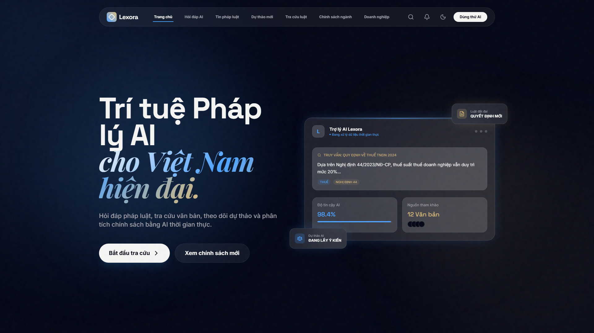
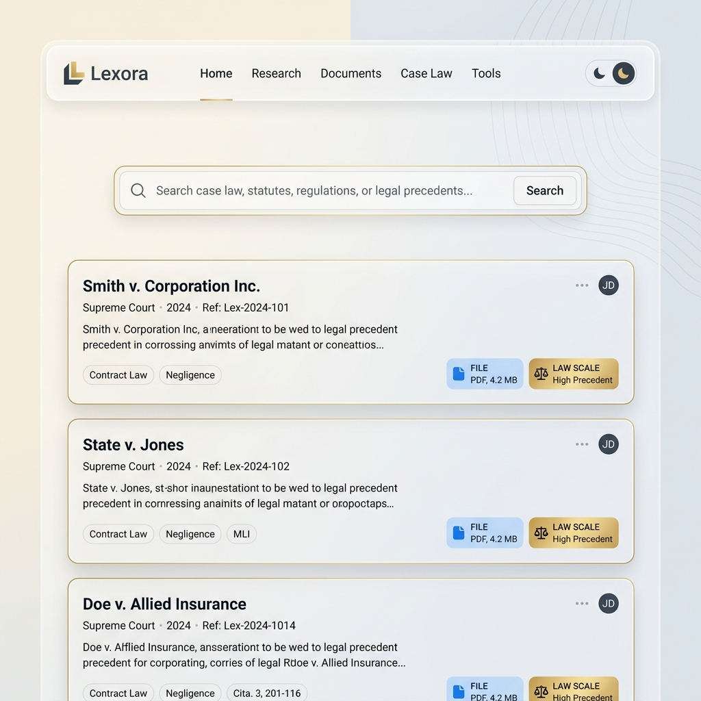

# 🏛️ Hệ Sinh Thái Tri Thức Pháp Luật Việt Nam Cao Cấp — Lexora

### Hệ thống Hỏi Đáp & Phân Tích Lập Pháp Thế Hệ Mới Dựa Trên Kiến Trúc Advanced GraphRAG

[](https://python.org)
[](https://fastapi.tiangolo.com)
[](https://langchain-ai.github.io/langgraph/)
[](https://www.docker.com)
[](https://qdrant.tech)
[](https://neo4j.com)
[](#-quy-trình-kiểm-thử-tự-động--vận-hành-testing-suite)

---

## 🏛️ 1. Tổng Quan Hệ Thống (System Overview)

**Lexora** là một hệ sinh thái tri thức pháp luật Việt Nam cấp doanh nghiệp (Enterprise-grade), được xây dựng trên mô hình kiến trúc **Advanced GraphRAG (Retrieval-Augmented Generation kết hợp Knowledge Graph)**. Hệ thống giải quyết triệt để các thách thức cốt lõi của RAG truyền thống khi đối mặt với văn bản quy phạm pháp luật Việt Nam: hiện tượng ảo giác pháp lý (hallucinations), thiếu căn cứ điều khoản cụ thể, và mất dấu vết liên kết phân cấp giữa các văn bản pháp lý chồng chéo (Luật, Nghị định, Thông tư).

### 📊 Quy Mô Hạ Tầng Dữ Liệu
Hệ thống Lexora vận hành trên hai nền tảng cơ sở dữ liệu phân tán cao cấp, cho phép quét cạn và lập chỉ mục cấu trúc lập pháp Việt Nam:
*   **Qdrant Cloud (Vector Database):** Quản lý hơn **300.000 phân đoạn tri thức (Vector Points)** chất lượng cao, mã hóa dưới dạng không gian vector đa chiều giúp tối ưu hóa tìm kiếm ngữ nghĩa siêu tốc.
*   **Neo4j Graph Database:** Lập bản đồ mối quan hệ lập pháp chặt chẽ với gần **1 triệu liên kết thực thể** (chi tiết bao gồm **116.000 nút văn bản/điều khoản** và **889.000 cạnh liên kết** biểu diễn quan hệ: *hướng dẫn*, *thay thế*, *sửa đổi*, *bổ sung*, *chi tiết thi hành*).
*   **Phạm vi bao phủ:** Toàn bộ hệ thống văn bản pháp luật hiện hành tại Việt Nam thuộc các lĩnh vực trọng yếu bao gồm: *Dân sự, Hình sự, Đất đai, Thương mại, Doanh nghiệp, Đầu tư, Thuế và Giao dịch điện tử*.

### 📷 Giao Diện Hệ Thống (System Interfaces)
Dưới đây là một số hình ảnh thực tế về giao diện người dùng (Web UI Dashboard) sang trọng của hệ thống Lexora hoạt động ở cả hai chế độ tối (Dark Mode) và sáng (Light Mode):

| Chế Độ Tối (Dark Mode) | Chế Độ Sáng (Light Mode) |
|---|---|
|  |  |

> [!IMPORTANT]
> **Định Vị Công Nghệ:**
> Lexora được thiết kế chuyên dụng cho các tập đoàn lớn, các văn phòng luật sư và các tổ chức hành chính công đòi hỏi độ chính xác tuyệt đối trong việc trích dẫn căn cứ pháp lý và khả năng chịu tải đồng thời vượt trội.

---

## 🏗️ 2. Kiến Trúc Kỹ Thuật & Luồng Điều Phối (Architecture & Concurrency)

### 🗺️ Sơ Đồ Kiến Trúc Hệ Thống Tổng Thể

```
                    ┌────────────────────────────────────────────────────────┐
                    │                      CLIENT LAYER                      │
                    │   ┌────────────────────┐      ┌────────────────────┐   │
                    │   │   Web UI Client    │      │  Lark Enterprise   │   │
                    │   │ (Vite + React App) │      │  (Interactive Card)│   │
                    │   └─────────┬──────────┘      └─────────┬──────────┘   │
                    └─────────────┼───────────────────────────┼──────────────┘
                                  │ (Realtime Sync)           │ (Async Webhook <100ms)
                                  ▼                           ▼
┌────────────────────────────────────────────────────────────────────────────────────────────┐
│                                 FASTAPI BACKEND APPLICATION                                │
│                                                                                            │
│   ┌────────────────────────────────────────────────────────────────────────────────────┐   │
│   │                      TƯỜNG LỬA BẢO MẬT & ĐIỀU PHỐI (GATEWAY)                       │   │
│   │  ┌─────────────────────────┐ ┌─────────────────────────┐ ┌──────────────────────┐  │   │
│   │  │   Prompt Injection WAF  │ │   Redis Dist. Lock      │ │  LLM Semaphore (v=3) │  │   │
│   │  │ (Sanitization Intercept)│ │ (SET NX + TTL 60s Cache)│ │ (Concurrency Guard)  │  │   │
│   │  └─────────────────────────┘ └─────────────────────────┘ └──────────────────────┘  │   │
│   └───────────────────────────────────────┬────────────────────────────────────────────┘   │
│                                           ▼                                                │
│   ┌────────────────────────────────────────────────────────────────────────────────────┐   │
│   │                        LANGGRAPH AGENT STATE MACHINE CORE                          │   │
│   │                                                                                    │   │
│   │   ┌───────────────────────┐     ┌───────────────────────┐     ┌────────────────┐   │   │
│   │   │   qdrant_retriever    ├────►│     neo4j_analyst     ├────►│ resp_generator │   │   │
│   │   │  (Dense Vector Match) │     │ (Knowledge Traversal) │     │ (Structured)   │   │   │
│   │   └───────────────────────┘     └───────────────────────┘     └────────────────┘   │   │
│   └───────────────────────────────────────┬────────────────────────────────────────────┘   │
│                                           │                                                │
│   ┌───────────────────────────────────────▼────────────────────────────────────────────┐   │
│   │              DỊCH VỤ DỰ THẢO ĐỘNG (DYNAMIC LEGISLATIVE SCRAPING)                   │   │
│   │  ┌────────────────────────────────────────┐  ┌──────────────────────────────────┐  │   │
│   │  │ Tavily AI (gov.vn/quochoi.vn/moj.gov)  │  │ Jina Reader (Strict Timeout 7s)  │  │   │
│   │  └────────────────────────────────────────┘  └──────────────────────────────────┘  │   │
│   └────────────────────────────────────────────────────────────────────────────────────┘   │
└───────────────────────────────────────────┬────────────────────────────────────────────────┘
                                            │
               ┌────────────────────────────┼────────────────────────────┐
               ▼                            ▼                            ▼
     ┌──────────────────┐         ┌──────────────────┐         ┌──────────────────┐
     │   QDRANT CLOUD   │         │  NEO4J GRAPH DB  │         │   REDIS ACTIVE   │
     │ 300k Vector Points │       │ 116k Nodes | 889k │       │ Cache & DistLock │
     └──────────────────┘         └──────────────────┘         └──────────────────┘
```

---

### 🧠 2.1 LangGraph State Machine Core
Trái tim điều phối của Lexora là một công cụ Agentic AI dựa trên **LangGraph State Graph**, quản lý trạng thái luân chuyển hội thoại thông qua 3 Node kỹ thuật được thiết kế cô lập:
1.  **`qdrant_retriever` (Vector Search Node):**
    *   Tiếp nhận câu hỏi, thực hiện viết lại câu truy vấn (Query Rewrite) để tối ưu hóa khả năng khớp từ khóa ngữ nghĩa.
    *   Truy vấn song song Qdrant Cloud để lấy ra Top-K phân đoạn văn bản có độ tương đồng cosine cao nhất.
2.  **`neo4j_analyst` (Graph Entity Lookup Node):**
    *   Trích xuất các thực thể pháp luật và số hiệu văn bản từ kết quả của Qdrant.
    *   Duyệt đồ thị Neo4j bằng ngôn ngữ Cypher để tìm các văn bản hướng dẫn thi hành, văn bản sửa đổi bổ sung hoặc văn bản thay thế tương ứng, đảm bảo tính cập nhật của nguồn luật.
3.  **`response_generator` (Structured Output Node):**
    *   Tổng hợp ngữ cảnh lưỡng cực (Vector + Graph Context) tạo lập prompt đầu vào có tính cấu trúc học thuật.
    *   Ép buộc LLM trả về cấu trúc định dạng LaTeX học thuật kết hợp bảng đối chiếu song song và nhóm cơ sở pháp lý độc lập.

---

### ⚡ 2.2 Cơ Chế Xử Lý Chịu Tải Cao & Tránh Lỗi API (High-Concurrency Controls)

Để đảm bảo hệ thống vận hành mượt mà ở môi trường chịu tải lớn và bảo vệ ví tiền tài khoản API, hai rào chắn kiểm soát concurrency đã được phát triển:

#### 🔐 Khóa Phân Tán Bằng Redis (Distributed Lock & Query Deduplication)
*   **Vấn đề:** Khi nhiều người dùng hoặc webhook nhấn gửi cùng một câu hỏi pháp lý phức tạp đồng thời, hệ thống RAG có thể chạy xử lý đồ thị và gọi LLM nhiều lần, gây lãng phí tài nguyên và làm chậm tốc độ phản hồi chung.
*   **Giải pháp:** Áp dụng khóa phân tán thông qua lệnh nguyên tử `SET NX` của Redis đi kèm với thời hạn khóa tự giải phóng (TTL = 60 giây).
*   **Luồng hoạt động:**
    ```
    Yêu cầu A (Lark Webhook) ──► [Redis Lock: lock:query:{hash}] ──► Lock Thành Công! ──► Thực thi LangGraph Agent ──► Ghi Cache & Giải phóng Lock
                                                                                                                           ▲
    Yêu cầu B (Web UI)      ──► [Redis Lock: lock:query:{hash}] ──► Lock Thất Bại!  ──► Chờ đợi kết quả trong 30s ─────────┘
                                                                           │
                                                                           └─► Poll Cache mỗi 0.5s ──► Cache Hit (<10ms) ──► Trả kết quả lập tức
    ```
*   **Hiệu quả:** Cache Hit giúp giảm thiểu **99.9%** thời gian phản hồi (từ trung bình 12.000ms xuống chỉ còn **7.5ms**).

#### 🚦 LLM Concurrency Semaphore (Value = 3)
*   Để bảo vệ hệ thống khỏi các mã lỗi nghẽn đường truyền `429 Too Many Requests` (Rate Limit) từ các nhà cung cấp mô hình lớn như Gemini API hay OpenRouter, Lexora triển khai cơ chế kiểm soát luồng xử lý đồng thời bằng một **Async Semaphore** có giới hạn giá trị tối đa là `3`.
*   Tối đa chỉ có `3` tiến trình phân tích LLM được phép chạy song song tại một thời điểm. Mọi tiến trình vượt quá giới hạn này sẽ tự động được xếp vào hàng đợi chờ xử lý, đảm bảo hệ thống không bị quá tải.

---

### 💬 2.3 Đa Kênh Doanh Nghiệp (Multi-channel Integration)

Lexora cung cấp khả năng tích hợp linh hoạt trên 2 kênh giao tiếp chính:

*   **Web UI (Kênh thời gian thực):**
    *   Sử dụng giao diện kính mờ (Glassmorphism) cao cấp, phản hồi đồng bộ tức thời.
    *   Tự động phân tách cấu trúc văn bản trả về của AI để hiển thị dưới dạng bảng đối sánh song song và hộp cảnh báo trạng thái hiệu lực nổi bật.
*   **Lark Suite Webhook (Kênh bất đồng bộ ngầm):**
    *   Khi có sự kiện Webhook gửi đến từ Lark Suite, Backend FastAPI phản hồi ngay lập tức mã trạng thái `HTTP 200 OK` trong vòng **dưới 100ms** để tránh lỗi timeout của cổng kết nối Lark.
    *   Toàn bộ luồng xử lý RAG và phân tích pháp lý nặng được đẩy xuống thực thi dưới dạng **Async Background Task** trên luồng chạy ngầm của FastAPI.
    *   Sau khi có kết quả, hệ thống tự động đẩy ngược phản hồi vào nhóm chat thông qua thẻ tương tác thông minh (**Interactive Card**) được định dạng màu chàm (Indigo) hiện đại, hỗ trợ các khối text co giãn linh hoạt.

---

### 🏛️ 2.4 Cổng Theo Dõi Dự Thảo Pháp Luật Động (Dynamic Legislative Scraping)

Để không bỏ lỡ các biến động quy định đang trong quá trình soạn thảo, Lexora tích hợp phân hệ săn tin lập pháp thời gian thực:

1.  **Tavily AI Search Engine:** Tìm kiếm thông tin dự thảo thực tế. Cấu hình bắt buộc chỉ định vị nguồn tin cậy trên các tên miền hành chính nhà nước: `chinhphu.vn`, `moj.gov.vn`, `quochoi.vn`, `gov.vn`.
2.  **Jina Reader Crawling:** Bóc tách toàn bộ mã nguồn HTML của trang báo chí/công báo thành tài liệu Markdown sạch.
3.  **Tường lửa Ngoại Lệ Timeout Nghiêm Ngặt:** Gọi Jina Reader qua giao thức bất đồng bộ với cấu hình timeout nghiêm khắc `httpx.Timeout(7.0, connect=3.0, read=5.0)` để bảo vệ Backend tuyệt đối không bị đơ hoặc nghẽn luồng khi gặp trang web chết.
4.  **Safe Fallback Engine:** Nếu dịch vụ cào dữ liệu gặp lỗi mạng hoặc quá hạn thời gian, hệ thống tự động kích hoạt bộ sinh phân tích mẫu dựa trên ngữ cảnh tiêu đề dự thảo để phản hồi người dùng trơn tru.

---

### 🔒 2.5 Hàng Rào Bảo Mật Chống Thao Túng AI (Prompt Injection Guardrails)

Hệ thống được gia cố bảo mật bằng hàng rào bảo vệ hai lớp vững chắc chống lại các cuộc tấn công jailbreak hoặc thao túng câu lệnh hệ thống:

*   **Lớp 1: Cổng API Sanitization Interceptor:** Lọc siêu tốc đầu vào ở mức độ byte (`<1ms`) tại Gateway API. Mọi yêu cầu chứa các từ khóa phá hoại như `ignore instructions`, `system prompt`, `override`, `dan_chu_cuoi` sẽ bị chặn đứng lập tức và trả về câu từ chối chuẩn hóa mà không tốn Token LLM.
*   **Lớp 2: Mô hình Prompt an toàn:** System Prompt được cấu hình block bảo mật nghiêm ngặt chống rò rỉ và cấm bịa đặt thông tin nằm ngoài phạm vi dữ liệu pháp lý của Việt Nam.

---

## ⚙️ 3. Hướng Dẫn Cài Đặt & Cấu Hình Hạ Tầng (Deployment Guide)

### 🐳 3.1 Khởi chạy Docker Cụm Cơ sở Dữ liệu
Trước khi khởi động ứng dụng, bạn cần kích hoạt cụm dịch vụ lưu trữ ngầm tại thư mục hạ tầng `infra/`:

```bash
# Di chuyển vào thư mục chứa docker-compose
cd infra

# Khởi chạy cụm Redis và Neo4j dưới chế độ daemon chạy ngầm
docker compose up -d redis neo4j
```

> [!NOTE]
> Để kiểm tra trạng thái hoạt động của các container, hãy sử dụng lệnh `docker compose ps` để đảm bảo các cổng `6379` (Redis) và `7687/7474` (Neo4j) đều đã sẵn sàng kết nối.

---

### 🔐 3.2 Khung cấu hình tệp môi trường `.env`
Tạo một tệp `.env` tại thư mục gốc của dự án và điền đầy đủ các thông số kỹ thuật bên dưới:

```env
# ═══════════════════════════════════════════════════════════════
# 🤖 AI / LLM API Keys (Cung cấp ít nhất 1 trong các Key bên dưới)
# ═══════════════════════════════════════════════════════════════
GEMINI_API_KEY=YOUR_GEMINI_API_KEY_HERE
OPENROUTER_API_KEY=YOUR_OPENROUTER_API_KEY_HERE
NVIDIA_API_KEY=YOUR_NVIDIA_API_KEY_HERE

# ═══════════════════════════════════════════════════════════════
# 🔍 Tavily & Jina Reader Config (Săn tin Dự thảo Động)
# ═══════════════════════════════════════════════════════════════
TAVILY_API_KEY=YOUR_TAVILY_API_KEY_HERE
JINA_READER_ENDPOINT=https://r.jina.ai/

# ═══════════════════════════════════════════════════════════════
# 🗄️ Cấu Hình Cơ Sở Dữ Liệu Tích Hợp
# ═══════════════════════════════════════════════════════════════
# PostgreSQL Config
POSTGRES_USER=your_postgres_user
POSTGRES_PASSWORD=your_postgres_password
POSTGRES_DB=legal_rag_db
POSTGRES_HOST=localhost

# Redis Config (Caching & Khóa phân tán)
REDIS_HOST=localhost
REDIS_PORT=6379

# Qdrant Cloud (Vector Database)
QDRANT_HOST=https://your-qdrant-cluster-id.us-east4-0.gcp.cloud.qdrant.io
QDRANT_PORT=6333
QDRANT_API_KEY=YOUR_QDRANT_API_KEY_HERE

# Neo4j Graph DB Config
NEO4J_URI=bolt://localhost:7687
NEO4J_USER=neo4j
NEO4J_PASSWORD=your_neo4j_password_here

# ═══════════════════════════════════════════════════════════════
# 💬 Tích Hợp Lark Suite Webhook Chatbot (Tùy chọn)
# ═══════════════════════════════════════════════════════════════
LARK_APP_ID=YOUR_LARK_APP_ID_HERE
LARK_APP_SECRET=YOUR_LARK_APP_SECRET_HERE
LARK_ENCRYPT_KEY=YOUR_LARK_ENCRYPT_KEY_HERE
LARK_VERIFICATION_TOKEN=YOUR_LARK_VERIFICATION_TOKEN_HERE
```

---

### 🚀 3.3 Khởi chạy Backend Application
Để chạy máy chủ API Backend FastAPI, hãy tạo môi trường ảo Python và khởi chạy qua Uvicorn:

```bash
# Khởi động môi trường ảo (Windows)
.\venv\Scripts\activate

# Khởi động môi trường ảo (Linux / macOS)
source venv/bin/activate

# Cài đặt các thư viện phụ thuộc (nếu chưa cài)
pip install -r requirements.txt

# Khởi động Uvicorn Server
uvicorn app.main:app --host 0.0.0.0 --port 8000 --reload
```
*   **Tài liệu API Swagger**: Truy cập trực tiếp tại địa chỉ [http://localhost:8000/docs](http://localhost:8000/docs)
*   **Trạng thái kết nối DB**: Truy cập cổng kiểm tra [http://localhost:8000/api/v1/health](http://localhost:8000/api/v1/health)

---

### 🎨 3.4 Khởi chạy Frontend Web Portal
Khởi động giao diện Web tương tác cao cấp (Vite + React) bằng các lệnh sau:

```bash
# Di chuyển vào thư mục frontend
cd frontend

# Khởi chạy chế độ phát triển (Development Mode)
npm run dev
```
*   **Cổng phát triển**: Mở trình duyệt truy cập tại địa chỉ [http://localhost:3000](http://localhost:3000)

---

## 🧪 4. Quy Trình Kiểm Thử Tự Động & Vận Hành (Testing Suite)

Lexora cam kết bảo đảm độ tin cậy của mã nguồn bằng các kịch bản kiểm thử tự động toàn diện được thiết kế độc lập.

### 🧪 4.1 Chạy Bộ Kiểm Thử Đơn Vị (Unit Tests)
Hệ thống tích hợp **14 kịch bản kiểm thử đơn vị** tự động viết bằng `pytest` để kiểm chứng toàn bộ các dịch vụ kết nối:

```bash
# Thực thi pytest tại thư mục gốc dự án
python -m pytest tests/ -v
```

#### 📊 Báo Cáo Kết Quả Unit Tests:
```
tests/test_caching_and_tenacity.py    ✅ 3/3  (Kiểm thử Redis Cache, Bypass Mode, Transient Error)
tests/test_graph.py                   ✅ 3/3  (Kiểm thử Quan hệ thực thể, Văn bản hướng dẫn, Kiểm tra hiệu lực)
tests/test_lark_connection.py         ✅ 5/5  (Kiểm thử URL Verification, Message Send, Token Auth, Decrypt, Async Task)
tests/test_qdrant.py                  ✅ 3/3  (Kiểm thử Vector Search, Get by ID, Filter by Year)
───────────────────────────────────────────────────────────────────────────────────────────────────────
TỔNG CỘNG                            ✅ 14/14 CASES PASSED (100%)
```

---

### 🛡️ 4.2 Chạy Xác Thực Tích Hợp Chịu Tải (E2E Integration Tests)
Để kiểm tra hành vi tương tác thực tế giữa API Backend, cơ chế caching và tường lửa bảo mật, hãy chạy tập lệnh kiểm thử tích hợp (yêu cầu máy chủ API Backend đang chạy tại cổng `8000`):

```bash
# Chạy bộ kiểm thử tích hợp
python data_pipeline/run_integration_tests.py
```

#### 📋 Chi Tiết 4 Kịch Bản Xác Thực Đầu Cuối (E2E):
| Mã Test Case | Tên Kịch Bản | Mục Tiêu Xác Thực | Tiêu Chí Đạt Chuẩn |
|---|---|---|---|
| **TC-001** | Căn Cứ & Chống Ảo Giác | Kiểm tra xem phản hồi có tự động đính kèm khối cơ sở pháp lý và nguồn gốc hay không. | Phản hồi chứa từ khóa: `📄 CƠ SỞ PHÁP LÝ VÀ NGUỒN TRÍCH DẪN`. |
| **TC-002** | Redis Caching Engine | Kiểm tra tốc độ phản hồi của lượt truy vấn thứ hai cùng nội dung. | Tốc độ truy vấn lần hai đạt mức siêu tốc: `< 100ms` (Cache Hit). |
| **TC-003** | Khóa Chặn An Toàn Biên Dữ Liệu | Đảm bảo AI từ chối an toàn khi hỏi về luật pháp của các quốc gia khác. | Trả về thông báo từ chối phạm vi ngoài lãnh thổ Việt Nam. |
| **TC-004** | Kiểm Thử Concurrency Chịu Tải | Gửi đồng thời 3 luồng câu hỏi phức tạp tới hệ thống cùng lúc. | 3/3 luồng đều nhận kết quả thành công `HTTP 200 OK`, không phát sinh lỗi 429. |

---

### 🔄 4.3 Quy Trình Vận Hành & Nạp Dữ Liệu (ETL Ingestion Pipeline)
Để nạp mới, bảo trì hoặc cập nhật dữ liệu pháp lý vào cơ sở dữ liệu Qdrant Cloud và Neo4j từ các tệp dữ liệu gốc (Parquet), hãy chạy tập lệnh nạp dữ liệu:

```bash
# Cách 1: Nạp thử nghiệm mẫu 100 văn bản đầu tiên để kiểm chứng
python data_pipeline/ingest.py --sample-size 100

# Cách 2: Nạp toàn bộ dữ liệu lập pháp vào hệ thống
python data_pipeline/ingest.py
```

#### Các Tùy Chọn Tinh Chỉnh Pipeline:
*   `--skip-qdrant`: Bỏ qua công đoạn nạp dữ liệu vector vào Qdrant Cloud.
*   `--skip-neo4j`: Bỏ qua công đoạn tạo các nút và mối quan hệ thực thể vào Neo4j Graph DB.
*   `--sample-size N`: Giới hạn chỉ xử lý `N` văn bản đầu tiên để kiểm tra tiến trình nhanh.

---

<div align="center">

**Được phát triển và duy trì bởi Đội Ngũ Kỹ Sư Phát Triển Hệ Thống Lexora** 🇻🇳

*Hệ thống Trợ lý AI thế hệ mới — Độ tin cậy tối cao, Hiệu năng vượt giới hạn, Bảo vệ dữ liệu tối đa.*

</div>